# 🎓 AI Exam System

The **AI Exam System** is designed to demonstrate practical full-stack engineering skills through a complete examination workflow for **Students, Examiners, and Administrators**. It combines secure authentication, exam management, timed assessments, automatic evaluation, result analytics, AI-powered performance insights, PDF result generation, and result verification in one platform.


## 🛠️ Tech Stack

### Frontend

- React 19
- Vite
- React Router
- Axios
- Tailwind CSS
- Lucide React
- Recharts
- jsPDF
- XLSX

### Backend

- Node.js
- Express
- MongoDB
- Mongoose
- JWT
- bcryptjs
- Google Gemini API
- PDFKit
- CORS
- dotenv
- Zod
- Google Auth Library

### Deployment

- Frontend: Vercel
- Backend: Render
- Database: MongoDB Atlas

---


## 🔐 Authentication

### Login
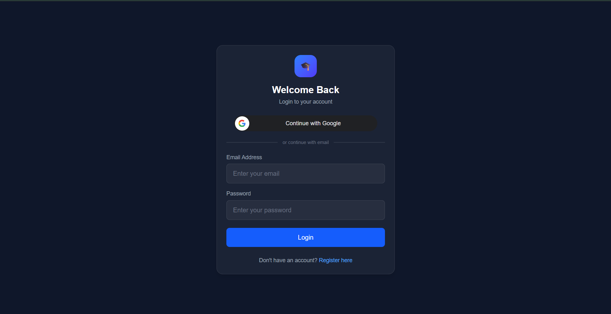

### Register
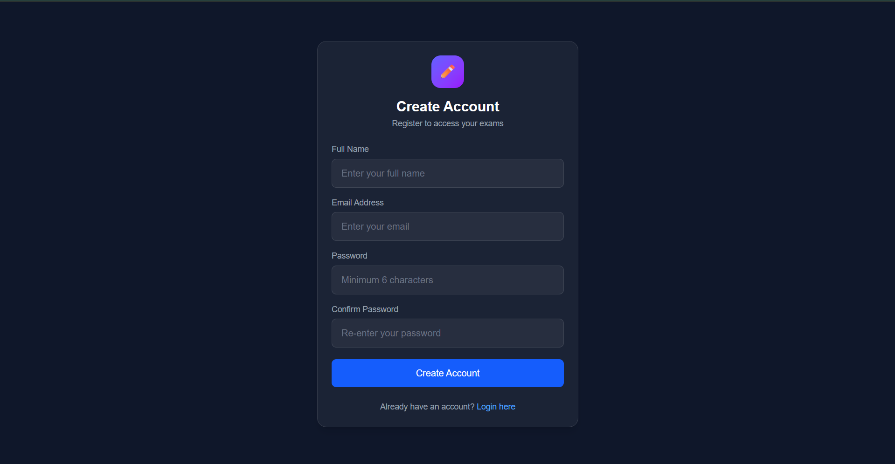

---

## 👨‍🎓 Student Portal

### Student Dashboard
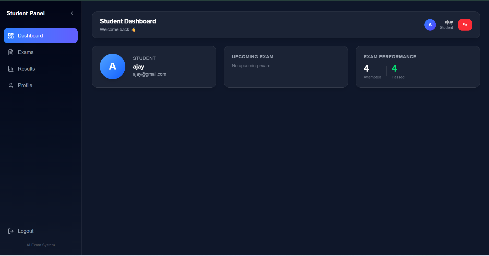

### Student Exams
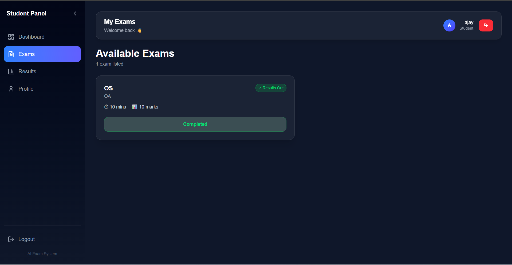

### Exam Attempt
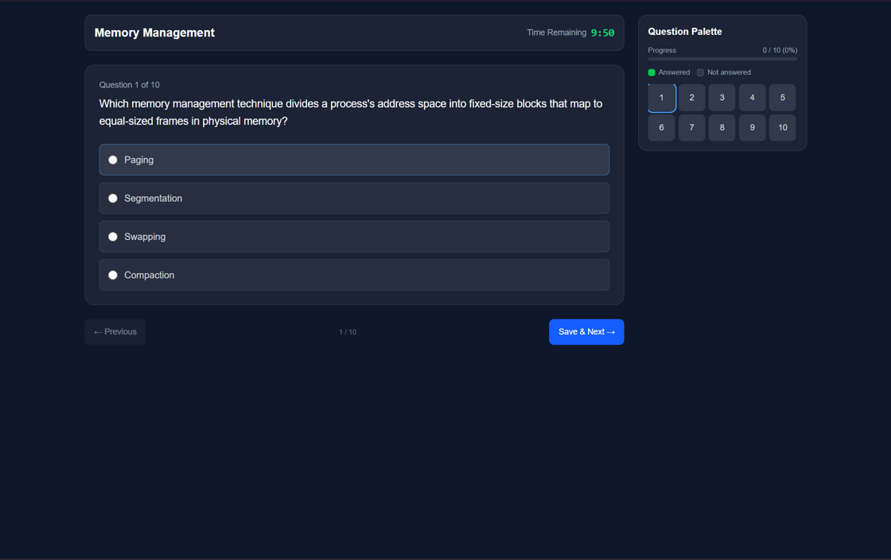

### Student Profile
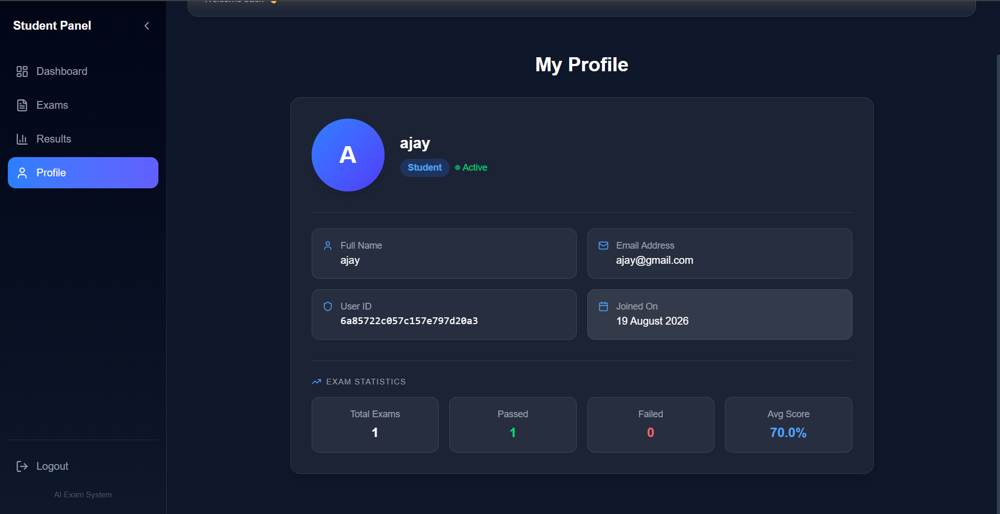

---

## 📊 Results & AI

### Results Dashboard
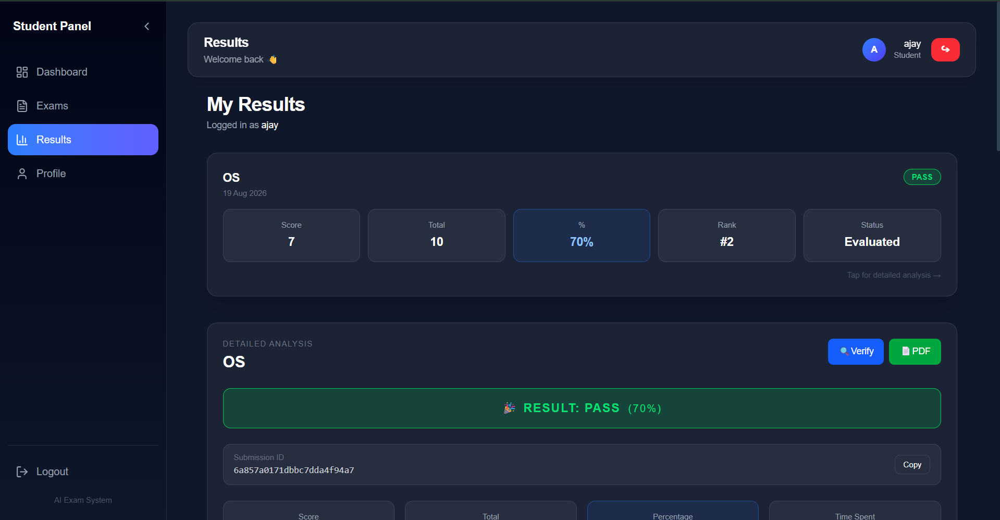

### Detailed Result
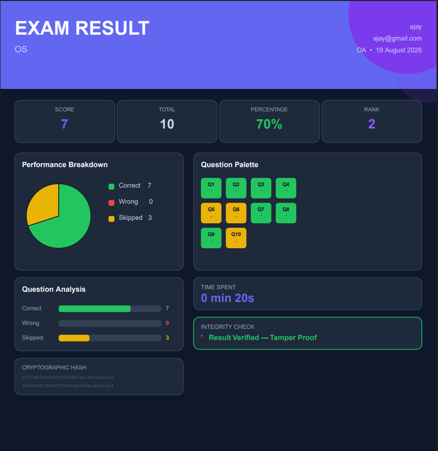

### AI Performance Insights
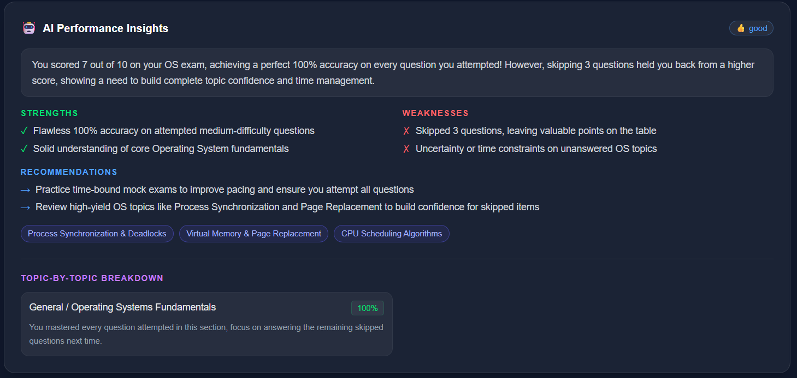

### Result Charts
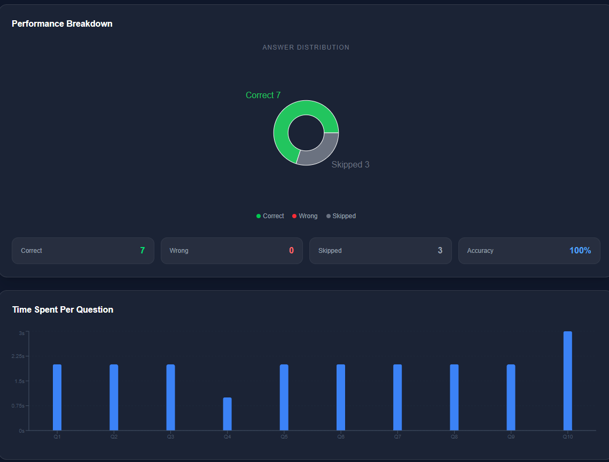

---

## 👨‍🏫 Examiner Portal

### Examiner Dashboard
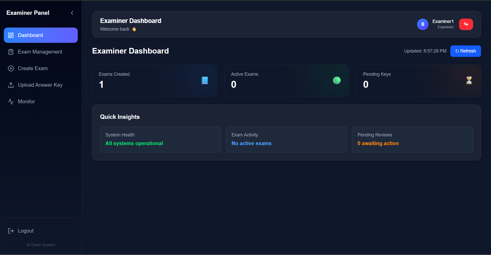

### Create Exam
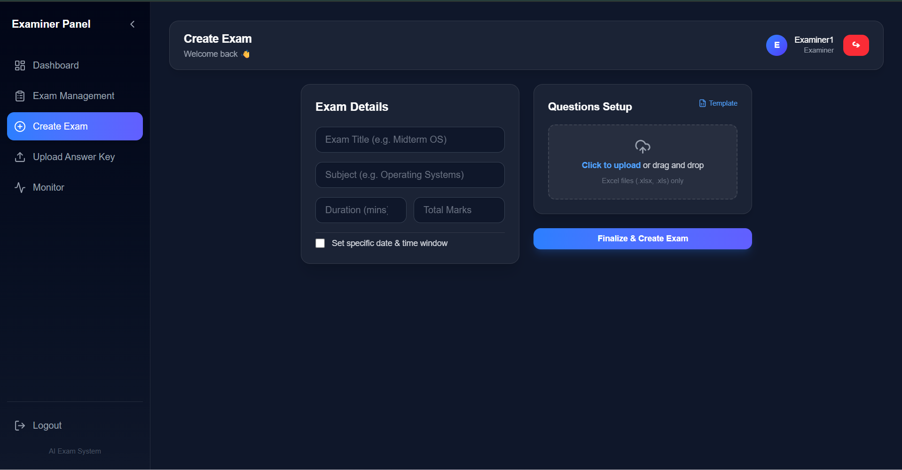


# ✨ Key Features

## 👨‍🎓 Student

- Secure registration and login
- Browse published examinations
- Start scheduled examinations
- Timed examination interface
- Question navigation palette
- Answered/unanswered tracking
- Exam submission
- Automatic evaluation
- View released results
- Question-level performance analysis
- Correct, incorrect, and skipped analysis
- Time-spent analysis
- Rank and percentage
- Download PDF result
- Verify result authenticity
- AI-powered performance insights
- Personalized strengths and weaknesses
- Recommended topics and difficulty

## 👨‍🏫 Examiner

- Examiner dashboard
- Create examinations
- Add questions
- Edit questions
- Delete questions
- Configure exam timing
- Publish examinations
- Update exam settings
- Upload answer keys
- Automatic result evaluation
- Release/hide results
- Monitor student submissions
- Track student attempt status

## 👨‍💼 Admin

- Role-based admin access
- View platform statistics
- Manage users
- Create student/examiner accounts
- Change user roles
- Delete users
- Assign examiners
- View system activity
- Monitor platform-level activity

---

# 🤖 AI Performance Analysis

The platform integrates **Google Gemini** to analyze evaluated examination results.

### AI Flow

```text
Student Submission
       ↓
Automatic Evaluation
       ↓
Topic + Difficulty Performance
       ↓
Google Gemini
       ↓
Structured AI Analysis
       ↓
Summary
Strengths
Weaknesses
Recommendations
Recommended Topics
Recommended Difficulty
Performance Level
Topic Analysis
       ↓
Stored in MongoDB
       ↓
Student Results → AI Insights
```

AI analysis is stored so previously generated insights can be retrieved without repeatedly generating the same analysis.

---

# 🔐 Security & Result Integrity

Security is an important part of the system.

### Authentication

- JWT-based authentication
- Password hashing with bcrypt
- Protected routes
- Role-based authorization
- Student, Examiner, and Admin access separation

### Result Integrity

At submission time:

```text
Student Answers
      ↓
Canonical Submission Data
      ↓
Cryptographic Hash
      ↓
Digital Signature
      ↓
Stored Submission
```

During verification:

```text
Stored Submission
      ↓
Recalculate Hash
      ↓
Verify Signature
      ↓
Authentic / Tampered
```

This allows the system to detect whether stored submission data has been modified.

### Exam Security

Depending on exam configuration, the platform supports:

- Fullscreen enforcement
- Tab-switch detection
- Copy/paste protection
- Security violation logging
- Auto-submit on configured violations
- Exam-level security configuration

---

# 🏗️ System Architecture

```text
                     ┌──────────────────────┐
                     │    React / Vite      │
                     │      Frontend        │
                     └──────────┬───────────┘
                                │
                           Axios / JWT
                                │
                                ▼
                     ┌──────────────────────┐
                     │   Express REST API   │
                     │       Backend        │
                     └──────────┬───────────┘
                                │
             ┌──────────────────┼──────────────────┐
             │                  │                  │
             ▼                  ▼                  ▼
      ┌─────────────┐    ┌──────────────┐   ┌─────────────┐
      │  MongoDB    │    │ Google       │   │ PDF /      │
      │ + Mongoose  │    │ Gemini AI    │   │ Security   │
      └─────────────┘    └──────────────┘   └─────────────┘
```

---

# 🔄 Core Application Flow

## 1. Authentication

```text
Register / Login
      ↓
JWT Issued
      ↓
AuthContext
      ↓
ProtectedRoute
      ↓
Role-specific Layout
```

## 2. Exam Creation

```text
Examiner / Admin
      ↓
Create Exam
      ↓
Add Questions
      ↓
Configure Timing + Security
      ↓
Publish Exam
```

## 3. Student Attempt

```text
Published Exam
      ↓
Student Starts Exam
      ↓
Timer + Question Navigation
      ↓
Answers Saved
      ↓
Submit
```

## 4. Evaluation

```text
Submission
      ↓
Answer Key Available?
      ↓
Automatic Evaluation
      ↓
Correct / Wrong / Skipped
```

## 5. Results

```text
Evaluation
      ↓
Score + Percentage
      ↓
Question-level Analysis
      ↓
Rank + Time Analysis + Charts
      ↓
PDF + AI Insights
      ↓
Result Verification
```

---

# 🌐 API Overview

The backend exposes REST APIs for authentication, examinations, submissions, results, AI insights, examiner operations, and administration.

| Method | Endpoint | Access | Purpose |
|---|---|---|---|
| POST | `/api/auth/register` | Public | Register student |
| POST | `/api/auth/login` | Public | Login |
| GET | `/api/exams` | Authenticated | List exams |
| POST | `/api/exams` | Admin / Examiner | Create exam |
| POST | `/api/exams/:examId/question` | Admin / Examiner | Add question |
| POST | `/api/exams/:examId/questions` | Admin / Examiner | Add multiple questions |
| PUT | `/api/exams/:examId/question/:questionId` | Admin / Examiner | Update question |
| DELETE | `/api/exams/:examId/question/:questionId` | Admin / Examiner | Delete question |
| POST | `/api/exams/:examId/answer-key` | Admin / Examiner | Upload answer key |
| PATCH | `/api/exams/:examId/publish` | Admin / Examiner | Publish exam |
| PATCH | `/api/exams/:examId/timing` | Admin / Examiner | Update timing |
| GET | `/api/exams/:examId/start` | Student | Start exam |
| POST | `/api/submissions/submit` | Authenticated | Submit exam |
| GET | `/api/submissions/verify/:id` | Public | Verify submission |
| GET | `/api/verify/:id` | Public | Verify result |
| GET | `/api/results/my-results` | Student | List own results |
| GET | `/api/results/:id` | Owner / Admin | Detailed result |
| GET | `/api/results/:id/download-pdf` | Owner / Admin | Download PDF |
| GET | `/api/results/:id/ai-insights` | Owner / Admin | Get AI analysis |
| POST | `/api/results/:id/ai-insights` | Owner / Admin | Generate AI analysis |
| GET | `/api/student/dashboard` | Student | Student dashboard |
| GET | `/api/examiner/dashboard` | Examiner / Admin | Examiner dashboard |
| GET | `/api/examiner/monitor/:examId` | Examiner / Admin | Monitor exam |
| GET | `/api/admin/stats` | Admin | Admin statistics |
| GET | `/api/admin/users` | Admin | List users |
| POST | `/api/admin/assign-examiner` | Admin | Assign examiner |

---

# 📁 Project Structure

```text
AI-Exam-System/
│
├── backend/
│   └── src/
│       ├── config/
│       ├── controllers/
│       ├── middleware/
│       ├── models/
│       ├── routes/
│       ├── utils/
│       ├── app.js
│       └── server.js
│
├── frontend/
│   └── src/
│       ├── components/
│       ├── context/
│       ├── hooks/
│       ├── layouts/
│       ├── pages/
│       ├── routes/
│       ├── services/
│       ├── App.jsx
│       └── main.jsx
│
├── screenshots/
│   ├── login.png
│   ├── register.png
│   ├── student-dashboard.png
│   ├── student-exams.png
│   ├── exam-attempt.png
│   ├── student-profile.png
│   ├── results.png
│   ├── result-detail.png
│   ├── ai-insights.png
│   ├── result-charts.png
│   ├── examiner-dashboard.png
│   └── create-exam.png
│
├── .gitignore
└── README.md
```

---

# ⚙️ Local Setup

## Prerequisites

- Node.js 18+
- MongoDB Atlas or local MongoDB
- Google Gemini API key
- Git

## 1. Clone Repository

```bash
git clone https://github.com/YOUR_USERNAME/ai-exam-system.git
cd ai-exam-system
```

## 2. Backend

```bash
cd backend
npm install
npm run dev
```

Backend:

```text
http://localhost:5000
```

## 3. Frontend

Open another terminal:

```bash
cd frontend
npm install
npm run dev
```

Frontend:

```text
http://localhost:5173
```

---

# 🔑 Environment Variables

## Backend `.env`

```env
PORT=5000
MONGO_URI=your_mongodb_connection_string
JWT_SECRET=your_strong_jwt_secret
JWT_EXPIRES_IN=7d
GEMINI_API_KEY=your_google_gemini_api_key
NODE_ENV=development
FRONTEND_URL=http://localhost:5173
```

## Frontend `.env`

```env
VITE_API_URL=http://localhost:5000/api
```


---

# 🚀 Deployment

## Frontend — Vercel

```text
Root Directory: frontend
Framework: Vite
Build Command: npm run build
Output Directory: dist
```

Frontend environment variable:

```env
VITE_API_URL=https://YOUR-BACKEND.onrender.com/api
```

## Backend — Render

```text
Root Directory: backend
Build Command: npm install
Start Command: node src/server.js
```

Backend environment variables:

```env
NODE_ENV=production
PORT=10000
MONGO_URI=your_mongodb_atlas_uri
JWT_SECRET=your_production_secret
JWT_EXPIRES_IN=7d
GEMINI_API_KEY=your_gemini_api_key
FRONTEND_URL=https://YOUR-APP.vercel.app
```

## Database — MongoDB Atlas

1. Create a MongoDB Atlas cluster.
2. Create a database user.
3. Configure network access.
4. Copy the connection string.
5. Add it as `MONGO_URI`.
6. Never expose the MongoDB URI in frontend code.

---


## Student Demo

```text
Login
  ↓
Student Dashboard
  ↓
Published Exams
  ↓
Start Exam
  ↓
Attempt Questions
  ↓
Submit
  ↓
Result
  ↓
Detailed Analysis
  ↓
AI Performance Insights
  ↓
Download PDF
  ↓
Verify Result
```

## Examiner Demo

```text
Examiner Login
  ↓
Create Exam
  ↓
Add Questions
  ↓
Configure Timing
  ↓
Publish
  ↓
Upload Answer Key
  ↓
Automatic Evaluation
  ↓
Monitor Students
  ↓
Release Results
```

## Admin Demo

```text
Admin Login
  ↓
Dashboard
  ↓
Manage Users
  ↓
Change Role
  ↓
Assign Examiner
  ↓
View Activity
```

# 📈 Future Improvements

Possible extensions include:

- Redis-backed rate limiting
- Refresh-token authentication
- Email verification
- Password reset
- Real-time exam monitoring with WebSockets
- Redis caching
- Queue-based AI processing
- Advanced proctoring
- Face verification
- Question-bank tagging and search
- Bulk question import
- Automated CI/CD
- Automated backend testing
- OpenAPI / Swagger documentation
- Docker-based deployment
- Centralized error monitoring

---

# 👨‍💻 Author

**MOHIT KUMAR**

B.Tech — **CSE**  

- GitHub: `https://github.com/https://github.com/mohit-kumar-cse`

 


# 📄 License

This project was developed as an academic and portfolio project.

---

## ⭐ If you find this project useful

Consider giving the repository a ⭐ on GitHub.
